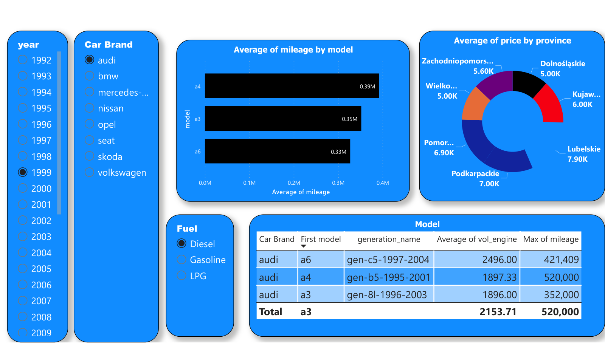

# Car Prices in Poland, 1992–2022 (Power BI)

An interactive dashboard on used-car listings in Poland covering 30 years of vehicles: price, mileage, engine size, brand, model generation, fuel type and province.

## What it answers
- **Mileage by model:** how hard each model is driven, for any brand and year
- **Regional pricing:** average price by Polish province
- **Model detail:** generation, average engine volume and maximum mileage in a drill-down table
- **Price ranking:** brands ranked by average price, from Volvo and Mercedes-Benz to Citroën (page 2 of the PDF)

Year, Brand and Fuel slicers filter the whole page. The screenshot shows diesel Audis from 1999.

**Tools:** Power BI Desktop (slicers, cross-filtering, matrix visual)
**File:** [`Car Prices in Poland from 1992 - 2022 gtb.pdf`](Car%20Prices%20in%20Poland%20from%201992%20-%202022%20gtb.pdf)
